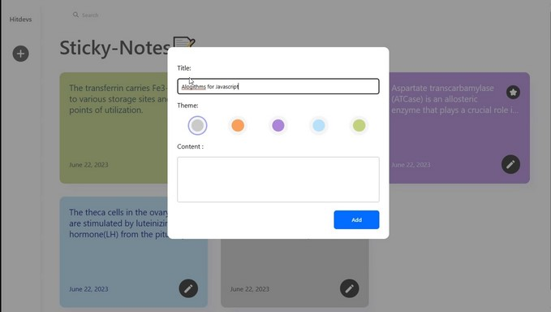
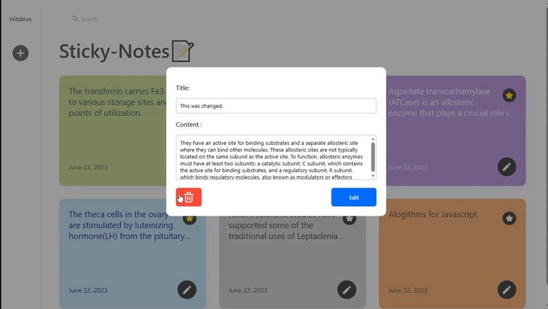
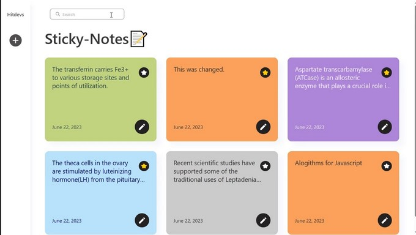

# Sticky Notes

A sticky notes app built with javascript . The app allows users to add , edit and delete notes.

The notes are stored  using the local storage API  to prevents users from losing their notes when the exit the app.

## Screenshots






## Run Locally

Clone the project

```bash
  git clone hhttps://github.com/Chucks1093/hitdevs/tree/main/sticky-notes
```

## Learnings

In this project I gained more insight into code optimization and css keyframe animation.

